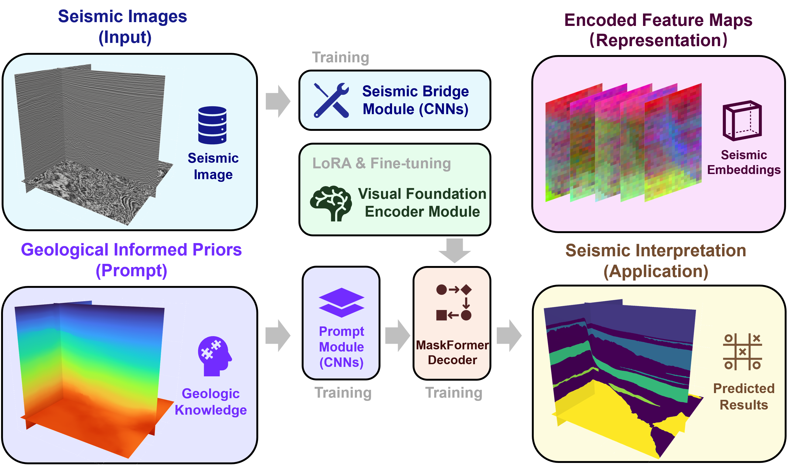

# cross-domain-seismic-fm-master
<p align="center">
  
</p>

Cross-domain transfer learning framework that adapts vision foundation models for seismic interpretation. This repository provides the implementation of our seismic-to-vision bridging strategy, efficient adaptation using LoRA and prefix tuning, geological prompting for structural consistency, and task-adaptive decoders for seismic facies segmentation and related interpretation tasks.

## Overview

Most deep learning models for seismic interpretation rely on task-specific architectures and large labeled datasets. This project introduces a cross-domain transfer learning framework that repurposes vision foundation models (FMs) for seismic understanding by:
- Mapping seismic amplitudes into the latent space of pretrained vision backbones
- Adapting foundation models efficiently using LoRA and prefix tuning
- Embedding geological priors (stratigraphic ordering) into the feature space
- Supporting multiple tasks such as facies segmentation, structural interpretation, and attribute prediction

## Features

- Seismic-to-vision bridge module
- Parameter-efficient adaptation (LoRA + prefix tuning)
- Geological prompting for structural consistency
- Task-adaptive decoder for segmentation or regression
- Benchmark results across diverse geological settings

## Installation

```bash
git clone https://github.com/jqfzfb/cross-domain-seismic-fm-master.git
cd cross-domain-seismic-fm-master
pip install -r requirements.txt
```

## Datasets

Example seismic data used in the manuscript can be downloaded from:

Figshare DOI: https://doi.org/10.6084/m9.figshare.30702569.v1

Other benchmark datasets:
- Netherlands F3 block: https://zenodo.org/records/1471548
- Parihaka 3D: https://wiki.seg.org/wiki/Parihaka-3D
- Teapot Dome dataset (SEG open data)

## Pretrained SAM Weights

SAM (Segment Anything Model) pretrained weights are available from:

https://github.com/facebookresearch/segment-anything

Place downloaded checkpoints under:

```bash
cross-domain-seismic-fm-master/sam_backbones/
```

## Acknowledgements

This project builds upon:
- SAM (Meta AI)
- PyTorch
- Public seismic datasets (F3, Parihaka, Teapot Dome)
